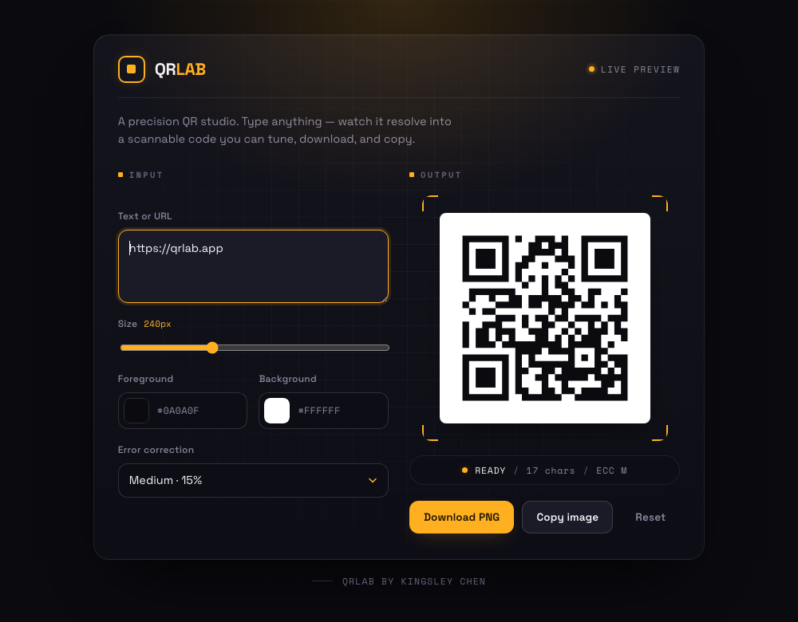
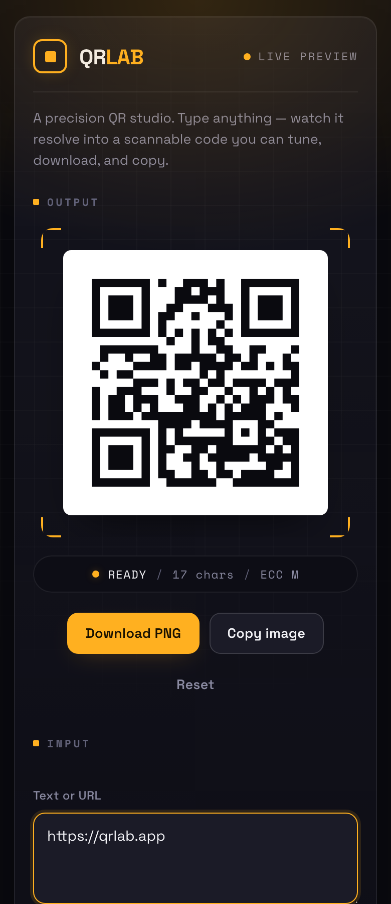

# QRLab

A precision QR code studio. Type any text or URL and instantly get a scannable QR
code you can customize, download, and copy — no accounts, no backend, no tracking.

QRLab is styled as a dark "instrument" console: a live viewfinder frames the code
with a scanner reticle and a sweep animation, and a monospace readout reports the
encoder status in real time.

> **QRLab by Kingsley Chen**

## Features

- **Live preview** — the QR code updates the moment you type.
- **Download as PNG** — one click saves a high-quality image.
- **Copy to clipboard** — copy the QR image directly (in supported browsers).
- **Customization**
  - Adjustable size (120–480px)
  - Foreground color
  - Background color
  - Error correction level (Low / Medium / Quartile / High)
- **Input validation** — actions stay disabled until you enter something.
- **Reset** — clear everything back to defaults in one click.
- **Responsive** — side-by-side on desktop, stacked on mobile.
- **Scannable output** — uses the well-tested `qrcode.react` renderer with a quiet
  zone margin so codes scan reliably.

## Tech stack

- [React](https://react.dev/) + [Vite](https://vite.dev/)
- [TypeScript](https://www.typescriptlang.org/)
- Plain CSS (no framework), with Space Grotesk + Space Mono for type
- [`qrcode.react`](https://github.com/zpao/qrcode.react) for QR rendering

No backend, no paid APIs.

## Getting started

Requires [Node.js](https://nodejs.org/) 18+.

```bash
# 1. Install dependencies
npm install

# 2. Start the dev server
npm run dev
```

Then open the URL Vite prints (usually http://localhost:5173).

### Other scripts

```bash
npm run build     # Type-check and build for production (outputs to dist/)
npm run preview   # Preview the production build locally
```

## Project structure

```
src/
  App.tsx                  # Layout, header, footer
  main.tsx                 # React entry point
  components/
    QRGenerator.tsx        # Input, controls, live preview, and actions
  styles/
    index.css              # All app styling
```

## How the QR code stays scannable

- Rendering is handled by `qrcode.react`, a mature library implementing the QR spec.
- A margin (quiet zone) is kept around the code so scanners can find it.
- Raising the **error correction level** adds redundancy — helpful if you plan to
  print small or use custom colors. For best results keep good contrast between the
  foreground and background colors.

## Screenshots

| Desktop | Mobile |
| ------- | ------ |
|  |  |

## License

MIT — free to use and modify.
